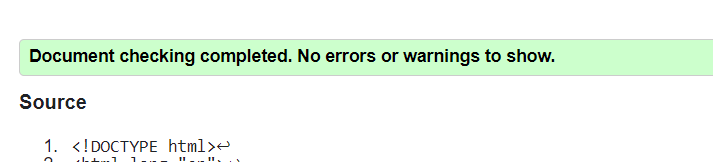
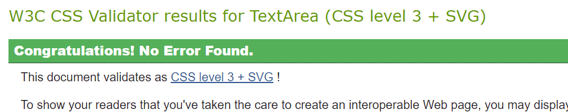

# Rock Paper Scissors Game

Rock, Paper, Scissors is a simple yet entertaining game for players of all ages. The game does have 9 outcome combinations. Draws happen a third of the time, so for the rest of it there is a winner. The game is not complicated, the player has to choose one out of three buttons: Rock, Paper or Scissors. The rules are: Rock blunts Scissors, Scissors cuts Paper, Paper covers Rock. The objective is to defeat the computer by choosing a correct weapon without knowing the computer's choice.

## Features

### Existing Features

- __The Header__

  - The header tells the users what game they are playing and displayes rules of the game in a clear, simple way.

- __The Game Options__

  - There's three buttons to choose from: Rock, Paper and Scissors.
  - Once a player clicks the button of their choice, computer makes its choice too and both choices are displayed along with the result for the user.

- __The Game Results__

  - The round can end in three different ways for the player. It can be a draw, win or loss.
  - JavaScript code chooses a random option for the computer and displays it beside the players choice.
  - The result is displayed under the player and the computer choices, along with either of the messages: "It's a Draw!", "You Win!", "You Lose!".
  - The result is clear for the user and the score is updated either for the player or the computer.

  

- __The Footer__

  - The footer section includes a clear message, displaying "Select a symbol to play again!". The player has to choose and click the button to play again.

### Features Left to Implement

- __Room for improvement__
  
  - This game can have better graphics and use sound effects to emphasize winning and losing, making it more interactive.
  - Add player name submission.
  
## Testing

This site was tested on all screen sizes, on Chrome and Microsoft Edge browsers.

### Validator Testing

- HTML
  - No errors were returned when passing through the official [W3C validator](https://validator.w3.org/nu/)

  

- CSS
  - No errors were found when passing through the official [(Jigsaw) validator](https://jigsaw.w3.org/css-validator/)
  

- JavaScript
  - No errors were found when passing through the JavaScript validator (<https://jshint.com/>)
  

- Lighthouse
  - The site has been tested with Lighthouse for desktop:
  

  - and for mobile:
  
  

## Deployment

- The site was deployed to GitHub pages. The steps to deploy are as follows:
  - In the GitHub repository, navigate to the Settings tab
  - From the source section drop-down menu, select the Master Branch
  - Once the master branch has been selected, the page will be automatically refreshed with a detailed ribbon display to indicate the successful deployment.

The live link can be found here - <https://madeleine2086.github.io/pp2/>

# Technology

+ HTML - for building the UI
+ CSS - for styling the UI
+ Javascript - for the the game play and interaction
+ Gitpod - for the game development
+ Github Pages - to host the game

## Credits

- This project was inspired by example project Rock-Paper-Scissors at the end of the Javascript module.
- The code written was inspired by the work of following online creators and their attempts to create the very same game:
  - <https://www.youtube.com/@AniaKubow>
  - <https://www.youtube.com/@BroCodez>
  - <https://www.youtube.com/@akademiafrontendu9706>
- The little graphics for buttons were taken from [Font Awesome](https://fontawesome.com/)
